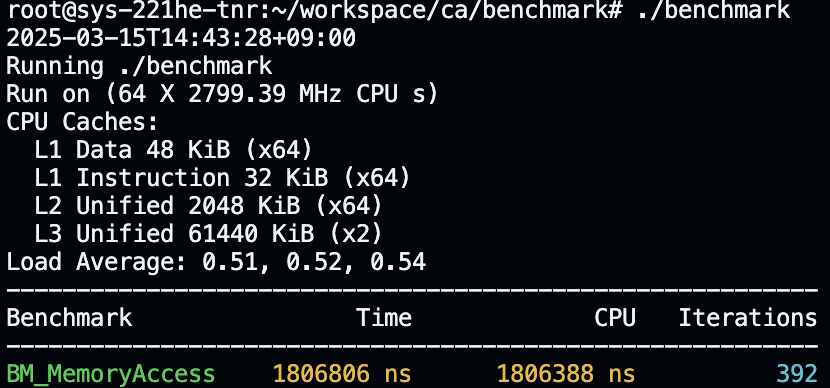
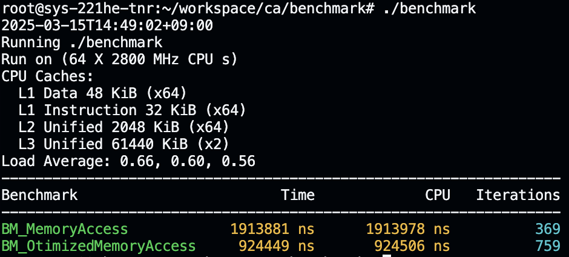

# Assignment 1: Memory Opcodes vs. Register Utilization Performance (using Google Benchmark)

Welcome to the first programming assignment for CAS3102.02-0 at Yonsei University in Spring 2025!
You have 14 days to complete this assignment. Please read the instructions carefully and ensure that you submit your work on the LearnUs platform (https://learnus.yonsei.ac.kr) before the deadline.

## Goal of Assignment

- Use [Google Benchmark](https://github.com/google/benchmark) to compare memory access vs. register utilization performance and quantitatively analyse execution time.
- Write C++ code and measure its execution performance using Google Benchmark.
- Experimentally determine the impact of direct memory access and register utilization on CPU performance.


## Setup

To write source code and run Google Benchmark, make sure you have the following packages installed:
- [Git](https://git-scm.com/downloads)
- [CMake](https://cmake.org/download/#latest)
- [GCC](https://gcc.gnu.org/install/)

## Getting started
### Install Google Benchmark
Follow [this guide](https://github.com/google/benchmark?tab=readme-ov-file#installation) to install Google Benchmark.
Below is the code I used for the build process.
```bash
$ git clone https://github.com/google/benchmark.git
$ cd benchmark
$ cmake -E make_directory "build"
$ cmake -E chdir "build" cmake -DBENCHMARK_DOWNLOAD_DEPENDENCIES=on -DCMAKE_BUILD_TYPE=Release ../
$ sudo cmake --build "build" --config Release --target install
```
### Run base line code
Save the below code as benchmark_memory.cpp in your working directory.
```c++
#include <benchmark/benchmark.h>
#include <vector>
#include <iostream>

constexpr int ARRAY_SIZE = 1000000;
std::vector<int> A(ARRAY_SIZE, 1);

static void BM_MemoryAccess(benchmark::State& state) {
    for (auto _ : state) {
        int sum = 0;
        for (int i = 0; i < ARRAY_SIZE; i++) {
            sum += A[i];  
        }
        benchmark::DoNotOptimize(sum);
    }
}
BENCHMARK(BM_MemoryAccess);
BENCHMARK_MAIN();
```
First, extract assembled code of it. Extract assembled code as a file name "benchmark_memory.s". 

Second, run the baseline code on your system.Ensure Google Benchmark is installed (Refer to [this guide](https://github.com/google/benchmark?tab=readme-ov-file#installation)). Compile and run the benchmark with:
```bash
g++ -o benchmark benchmark_memory.cpp -lbenchmark -lpthread
./benchmark
```
Check the benchmarking results, and take a screenshot. Below is an example:

Third, build a optimized for-loop code module BM_OtimizedMemoryAccess in the given code. Hint: Use registers! 
```c++
#include <benchmark/benchmark.h>
#include <vector>
#include <iostream>

constexpr int ARRAY_SIZE = 1000000;
std::vector<int> A(ARRAY_SIZE, 1);

static void BM_MemoryAccess(benchmark::State& state) {
    for (auto _ : state) {
        int sum = 0;
        for (int i = 0; i < ARRAY_SIZE; i++) {
            sum += A[i];  
        }
        benchmark::DoNotOptimize(sum);
    }
}
BENCHMARK(BM_MemoryAccess);

static void BM_OtimizedMemoryAccess(benchmark::State& state) {
    // fill here
}
BENCHMARK(BM_OptimizedMemoryAccess);
BENCHMARK_MAIN();
```
Complile and run the code.
```bash
g++ -o benchmark benchmark_memory.cpp -lbenchmark -lpthread
./benchmark
```
Compare its execution speed to see if the performance improves. Also take a screenshot. Below is an example:



